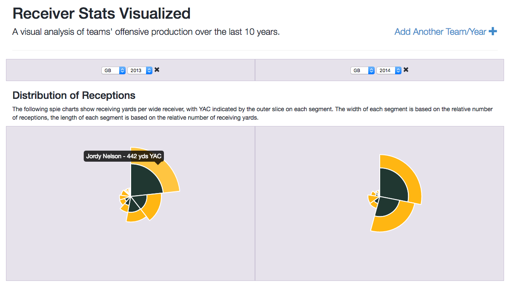
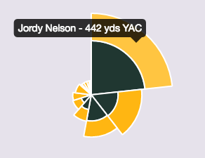

### Visualization of NFL Receptions by Team

## Motivation
The goal of this project was to visualize through [spie charts](https://angus.nyc/2015/a-spie-chart-for-chart-js/) how receptions are broken down per team. 

For a given team the spie chart shows the:
- distribution of receptions among receivers
- relative number of yards gained by each receiver
- split between yards in air and yards after catch for each receiver

The solution allows users to view up to three spie charts at the same time, either for the same team over different years, or for different teams.

## Technical
The solution is written in AngularJS and Node, and uses data obtained through the [nfl-data](https://github.com/angusmacdonald/nfl-data-ui) tool.

When the webpage is initially opened a default set of spie charts are shown. The request for spie charts is made to the node server, which forwards the request onto a Mongo DB database.

 

The following features are notable:
 - Local storage is used extensively, so spie data is only requested once for each team-year pairing.
 - The page URL represents what spie charts are currently shown, making it easy to share links to specific sets of charts.
 - The data is converted into the spie chart format client-side, allowing it to be used in a number of different ways, rather than for only rendering spie charts.
 - Team colors are used to display chart information, with data taken from the excellent [teamcolors](http://teamcolors.arc90.com/) site.
 - 

